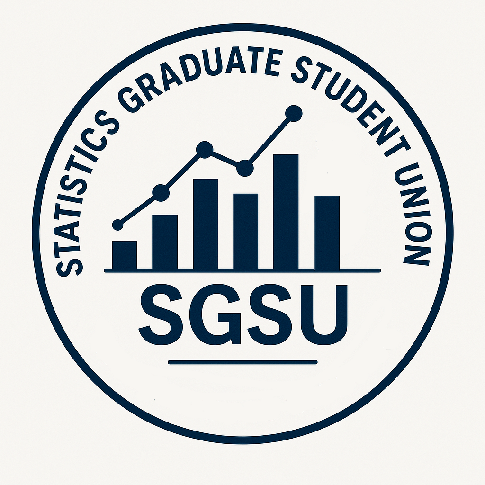

```{r setup, include=FALSE}
knitr::opts_chunk$set(echo = FALSE)
```



The Statistics Graduate Student Union is a student group at the University of Toronto which represents graduate students (MSc and PhD) in the Department of Statistical Sciences. We organize events for our graduate students and represent their interests to the university. We have organized the annual Statistics Student Research Day, jointly with the Department, since 2010. 

## [Constitution](./constitution.html)

## Contact

Email: sgsudoss[at]gmail.com


