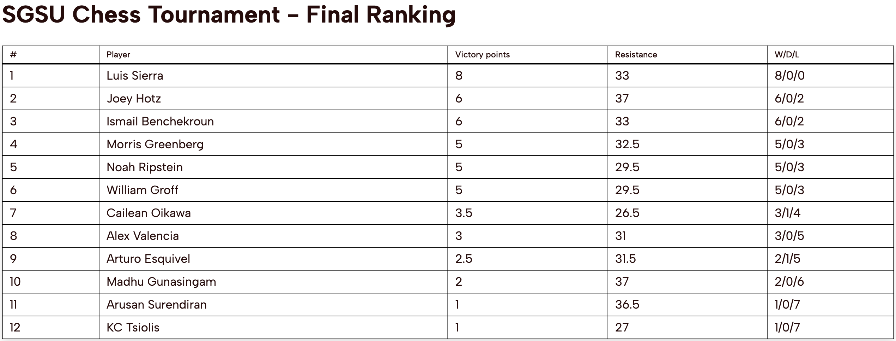
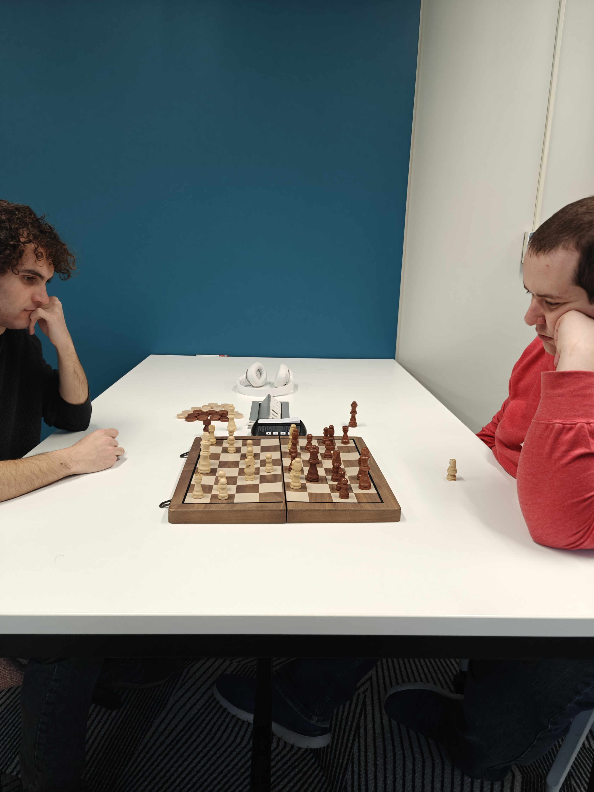

<style type="text/css">
  html {
    --title-size: 60px;
    --title-color: #002f65;
  }
  h1 {
    text-align: center;
  }
</style>

```{r setup, include=FALSE}
knitr::opts_chunk$set(echo = FALSE)
```

1. Luis Sierra
2. Ismail Benchekroun (Prize Winner)
3. Joey Hotz



